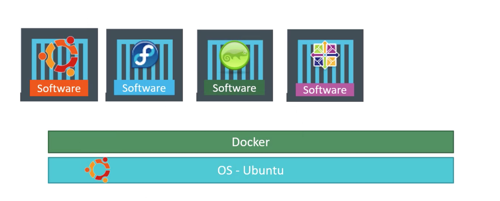
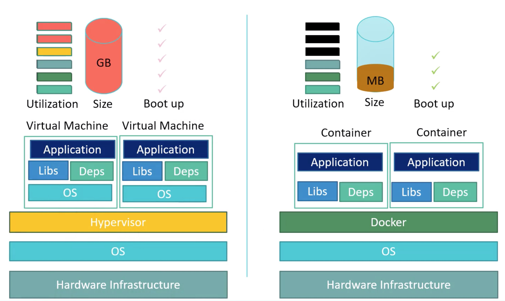
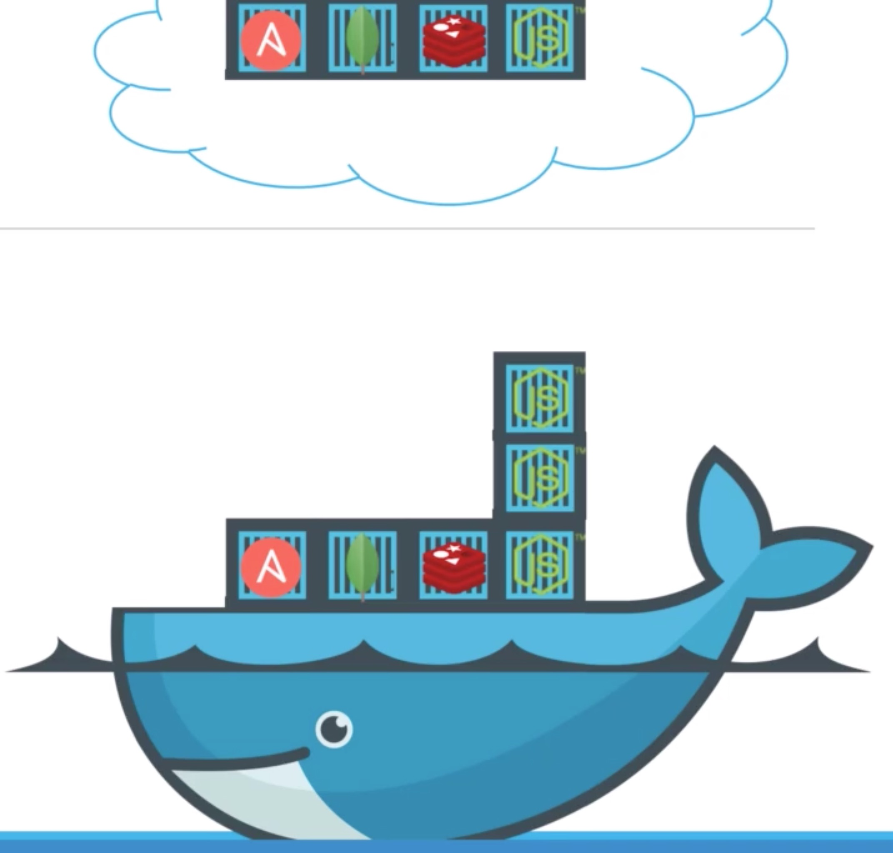
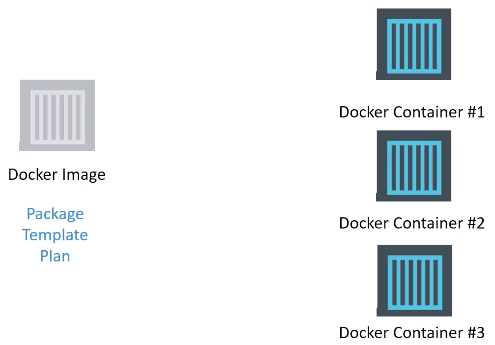
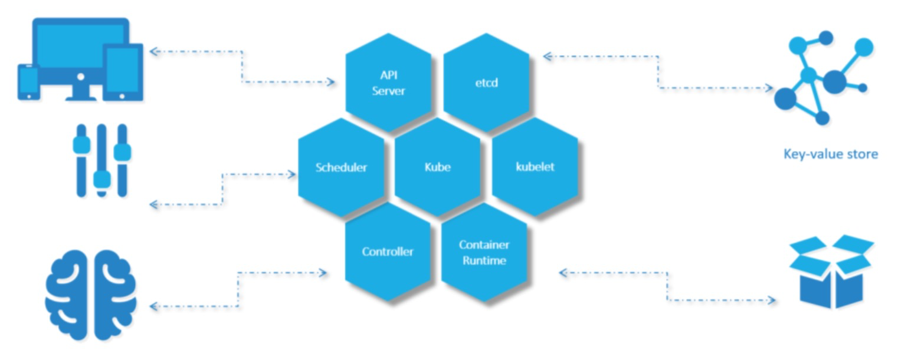

# Docker

## Introduction

Docker is a container technology.

Unlike hypervisors, docker is not meat to virtualize and run different operating systems and kernels on the same hardware.

The main purpose of docker is to containerize applications and to ship them and run them.

## Containers vs. Virtual Machines

- VM:

  Advantages: Fully independent and isolated environment. You can host both Windows OS and Linux OS on the same hypervisor host.

  Disadvantages: Independent OS with higher overhead. Large and slow.

- Container:

  Advantages: Only contains applications and its necessary liberaries and dependencies. Fast and easy to scale.

  Disadvantages: Less isolation as more resources are shared in the kernel. You can host only one type of OS on the same docker host.

## How does it work?

Docker Hub --> Local

Container vs. image

## Continuous Delivery

# Kubernetes

## Introduction

It is a container orchestration technology used to orchestrate the deployment and management of hundreds and thousands of containers in a cluster environment.

## Architecture

### Nodes (Minions)

### Cluster

### Master

### Components

#### API server

#### etcd

#### kubelet

#### Container Runtime

#### Controller

#### Scheduler

## PODs

## Replica Sets

## Deployments

## Networking

## Services