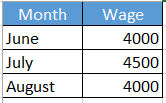
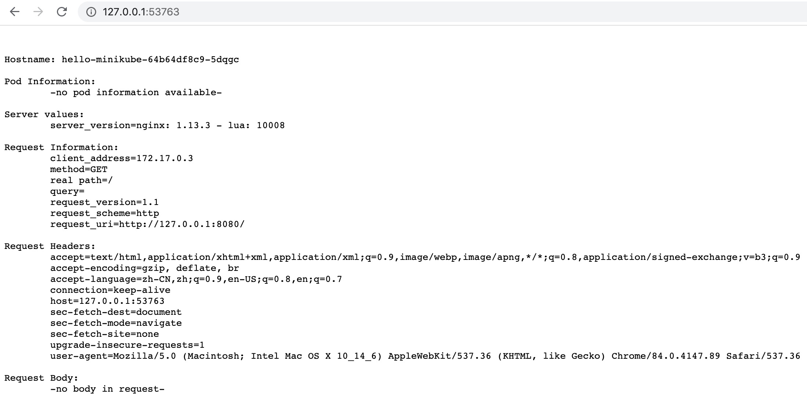

# Setup Experiment Environment

## [Download and Install VirtualBox](https://download.virtualbox.org/virtualbox/6.1.12/VirtualBox-6.1.12-139181-OSX.dmg)

## [Download and Install Docker](https://download.docker.com/mac/stable/Docker.dmg)

## Install Minikube

```bash
$ brew update && brew install minikube
```

## Start Minikube

```bash
$ minikube start --driver=docker
😄  minikube v1.12.1 on Darwin 10.14.6
✨  Using the docker driver based on user configuration
👍  Starting control plane node minikube in cluster minikube
🔥  Creating docker container (CPUs=2, Memory=1991MB) ...
🐳  Preparing Kubernetes v1.18.3 on Docker 19.03.2 ...
🔎  Verifying Kubernetes components...
🌟  Enabled addons: default-storageclass, storage-provisioner
🏄  Done! kubectl is now configured to use "minikube"

💡  You can also use 'minikube kubectl -- get pods' to invoke a matching version
```

## Minikube Management

```bash
$ minikube status
minikube
type: Control Plane
host: Running
kubelet: Running
apiserver: Running
kubeconfig: Configured
```

```bash
$ minikube dashboard
🤔  Verifying dashboard health ...
🚀  Launching proxy ...
🤔  Verifying proxy health ...
🎉  Opening http://127.0.0.1:53202/api/v1/namespaces/kubernetes-dashboard/services/http:kubernetes-dashboard:/proxy/ in your default browser...
```

```bash
$ minikube stop
✋  Stopping "minikube" in docker ...
🛑  Powering off "minikube" via SSH ...
🛑  Node "minikube" stopped.
```

```bash
$ minikube delete
🔥  Deleting "minikube" in docker ...
🔥  Deleting container "minikube" ...
🔥  Removing /Users/euclideanrn/.minikube/machines/minikube ...
💀  Removed all traces of the "minikube" cluster.
```

## Checkout Your K8s Cluster

```bash
$ kubectl get nodes -o wide
NAME       STATUS   ROLES    AGE   VERSION   INTERNAL-IP   EXTERNAL-IP   OS-IMAGE       KERNEL-VERSION     CONTAINER-RUNTIME
minikube   Ready    master   19h   v1.18.3   172.17.0.3    <none>        Ubuntu 19.10   4.19.76-linuxkit   docker://19.3.2
```

```bash
$ kubectl cluster-info
Kubernetes master is running at https://127.0.0.1:32772
KubeDNS is running at https://127.0.0.1:32772/api/v1/namespaces/kube-system/services/kube-dns:dns/proxy

To further debug and diagnose cluster problems, use 'kubectl cluster-info dump'.
```

# YAML File

Use case:

- Jacob is 30 year old Male working as a Systems Engineer at a firm. Represent Jacob's information (Name, Sex, Title) in YAML format. Create a dictionary named Employee and define properties under it.
- Update the YAML file to represent the Projects assigned to Jacob. Remember Jacob works Multiple projects - Automation and Support. So remember to use a list.
- Update the YAML file to include Jacob's pay slips. Add a new property "Payslips" and create a list of pay slip details (Use list of dictionaries). Each payslip detail contains Month and Wage.



```yaml
Employee:
    Name: Jacob
    Sex: Male
    Age: 30
    Title: Systems Engineer
    Projects:
        - Automation
        - Support
    Payslips:
        - Month: June
          Wage: 4000
        - Month: July
          Wage: 4500
        - Month: August
          Wage: 4000
```

# POD

## Create from Command Line

```bash
$ kubectl create deployment hello-minikube --image=k8s.gcr.io/echoserver:1.10
deployment.apps/hello-minikube created
```

```bash
$ kubectl expose deployment hello-minikube --type=NodePort --port=8080
service/hello-minikube exposed
```

```bash
$ kubectl get pod
NAME                              READY   STATUS    RESTARTS   AGE
hello-minikube-64b64df8c9-5dqgc   1/1     Running   0          4m26s
```

```bash
$ minikube service hello-minikube --url
🏃  Starting tunnel for service hello-minikube.
|-----------|----------------|-------------|------------------------|
| NAMESPACE |      NAME      | TARGET PORT |          URL           |
|-----------|----------------|-------------|------------------------|
| default   | hello-minikube |             | http://127.0.0.1:53763 |
|-----------|----------------|-------------|------------------------|
http://127.0.0.1:53763
❗  Because you are using a Docker driver on darwin, the terminal needs to be open to run it.
```

Then you can see the web page:



Get information of the new pod from the command line:

```bash
$ kubectl get pods -o wide
NAME                              READY   STATUS    RESTARTS   AGE   IP           NODE       NOMINATED NODE   READINESS GATES
hello-minikube-64b64df8c9-5dqgc   1/1     Running   0          10m   172.18.0.5   minikube   <none>           <none>
```

```bash
$ kubectl describe pod hello-minikube-64b64df8c9-5dqgc
Name:         hello-minikube-64b64df8c9-5dqgc
Namespace:    default
Priority:     0
Node:         minikube/172.17.0.3
Start Time:   Fri, 31 Jul 2020 15:03:26 +0800
Labels:       app=hello-minikube
              pod-template-hash=64b64df8c9
Annotations:  <none>
Status:       Running
IP:           172.18.0.5
IPs:
  IP:           172.18.0.5
Controlled By:  ReplicaSet/hello-minikube-64b64df8c9
Containers:
  echoserver:
    Container ID:   docker://33ba9e66e17f9d2c2e33e27d670bd6868dcb114b1698b5a8fd273f14280e75fc
    Image:          k8s.gcr.io/echoserver:1.10
    Image ID:       docker-pullable://k8s.gcr.io/echoserver@sha256:cb5c1bddd1b5665e1867a7fa1b5fa843a47ee433bbb75d4293888b71def53229
    Port:           <none>
    Host Port:      <none>
    State:          Running
      Started:      Fri, 31 Jul 2020 15:03:38 +0800
    Ready:          True
    Restart Count:  0
    Environment:    <none>
    Mounts:
      /var/run/secrets/kubernetes.io/serviceaccount from default-token-hbstp (ro)
Conditions:
  Type              Status
  Initialized       True 
  Ready             True 
  ContainersReady   True 
  PodScheduled      True 
Volumes:
  default-token-hbstp:
    Type:        Secret (a volume populated by a Secret)
    SecretName:  default-token-hbstp
    Optional:    false
QoS Class:       BestEffort
Node-Selectors:  <none>
Tolerations:     node.kubernetes.io/not-ready:NoExecute for 300s
                 node.kubernetes.io/unreachable:NoExecute for 300s
Events:          <none>
```

## Create from YAML file

...

# Replica Set

...

# Deployment